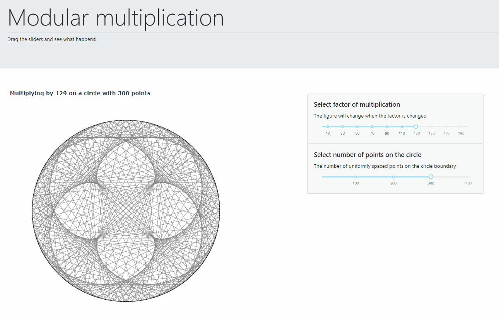

# Modular multiplication
Dash application for visualising modular multiplication

## Install
This project uses [pipenv](https://pipenv-fork.readthedocs.io/en/latest/).
Clone the repository, navigate to the folder and run `pipenv install`.
This creates a virtual environment for the project. Run `app.py` to see the
dashboard.
