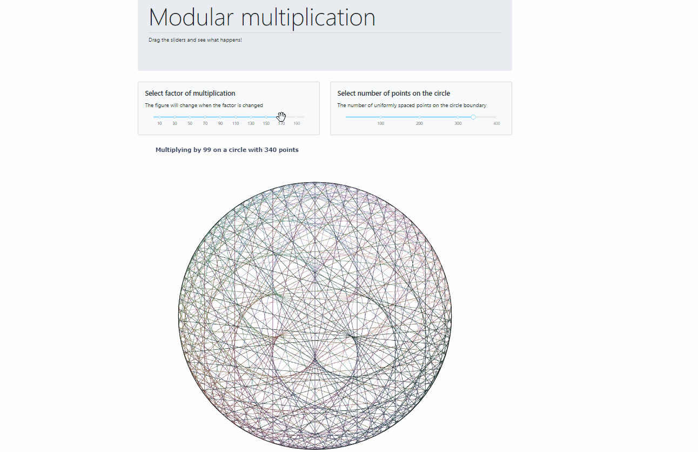

# Modular multiplication
Dash application for visualising modular multiplication

Try the heroku app [here](https://modular-multiply.herokuapp.com/)
## Install
This project uses [poetry](https://python-poetry.org/).
Clone the repository, navigate to the folder and run `poetry install`.
This creates a virtual environment for the project. Execute `app.py` run the dashboard locally.
